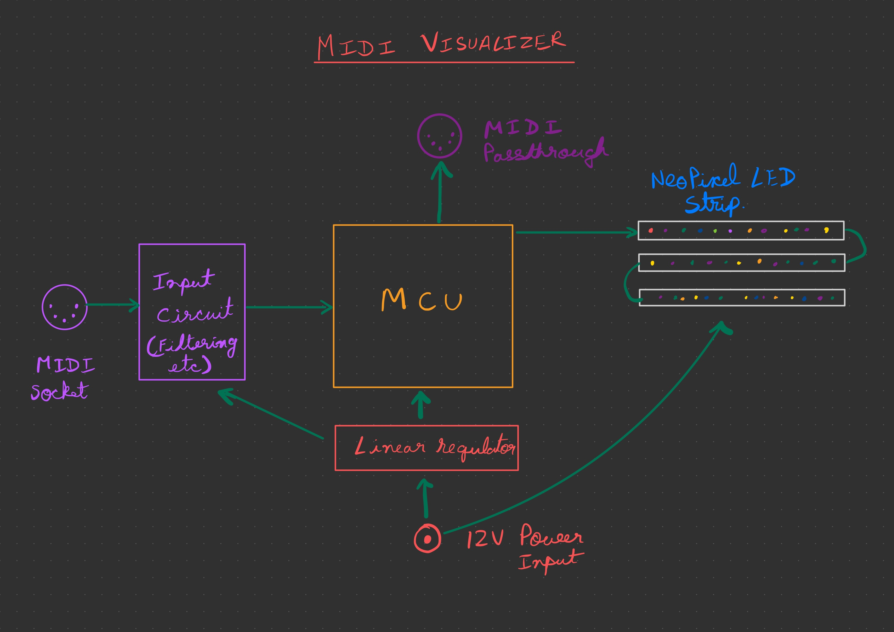
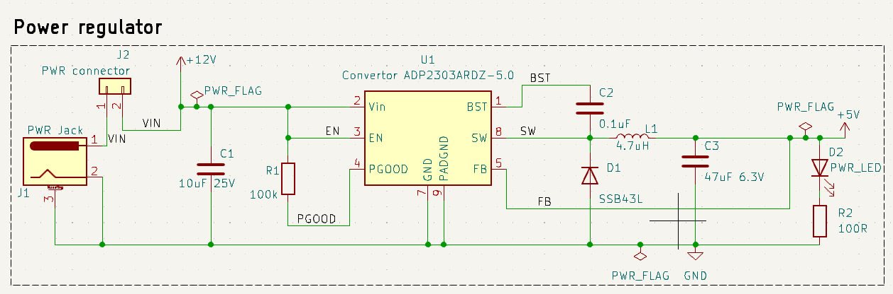
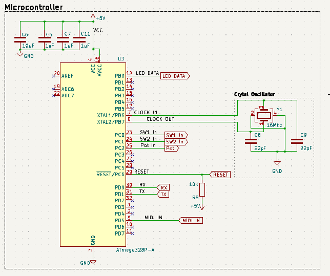
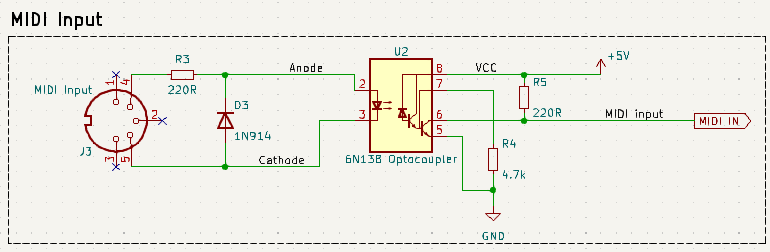
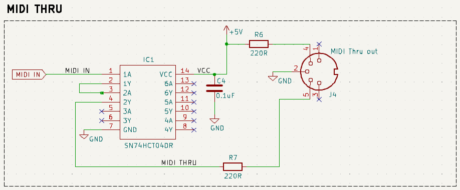
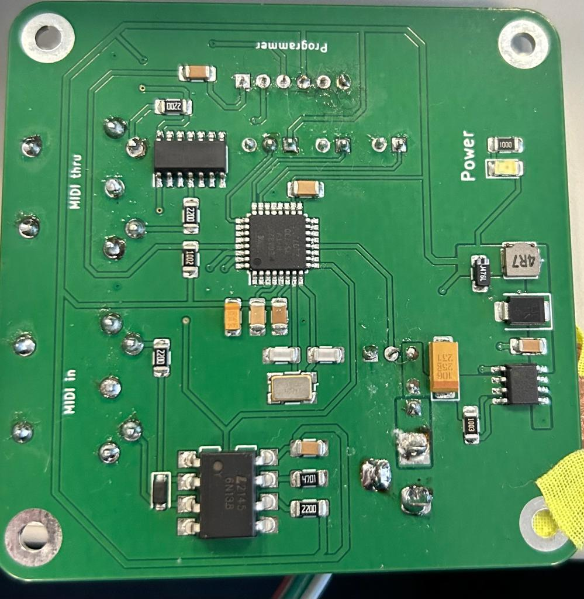

# MIDI Visualiser

by: Vagarth Gaurav and Maksim Eremenko


**Faculty of Technology and Bionics**

***Rhine-Waal University of Applied Sciences***

Date: 23 January 2024

----

## Abstract

The MIDI Visualiser implements an overarching idea of showing visual patterns on a rudimentary screen made of smart light-emitting diode (LED) strips based on the Musical Instrument Digital Interface (MIDI) keyboard output. The board design includes a buck-converter that steps down the power input voltage from 12v to 5v for the ATmega microcontroller unit (MCU), while also feeding the 12v to LED strips. MCU receives a MIDI input through a software serial, processes it and sends an output signal controlling an LED strip to display different patterns based on the pressed key. Out of curious ambition - prevalently SMD components were used, which ultimately led to a failed attempt to print at Hochschule Rhein-Waal (HSRW), instead the PCB was ordered from a third party. After arduous soldering, resoldering, coding and debugging the concept proved to be feasible. Although the prototype is working - further code optimization is necessary and additional ergonomic improvements should be considered.

## Table of Contents

[[_TOC_]]

## 1 Introduction

From the very dawn of Humankind our senses were the main gateway of perceiving and accepting the world around us. Throughout the social evolution of Homo sapiens, we've developed peculiar ways of stimulating our senses, ways that "make sense" only from a perspective of a conscious being with ears and sight. A marvelous play of stimulations to our hearing facilities that became known as music, and an intriguing play of visual symbols that found itself in different aspects of visual art and media. Consciously or not - our project stands among the attempts to unite and enhance an auditory sensation with a visual one.

At the end of the 20th century music entered the electronic era, synthesizers rose in popularity and MIDI was developed. Digital MIDI signals can be sent by any MIDI-compatibly musical instrument, such as keyboards, guitars and other more exotic contraptions. These signals contain information about the note being pressed or released, which can be processed by a 3rd party computing unit usually responsible for generating a corresponding sound, but in our case - responsible for generating visual patterns on an LED screen made of smart LED strips (further simply "LED screen").

LED screen therefore can dynamically respond to the notes being played, different animated patterns can be shown in different parts of the screen. Patterns can be colored and animated based on the press and release velocities creating an immersive supplementary experience to the music being played.

The following Chapter 2 presents our approach to implementing this idea, the hardware we designed and the software we wrote, as well as inevitable issues we've encountered.
Chapter 3 describes and illustrates the results, our success and our shortcomings. 
Finally, Chapter 4 will discuss the viability of our approach and potential improvements.

## 2	Methodology

### 2.1	Concept development

The initial concept was outlined in the following diagram:


A block diagram of an initial idea.

The following MIDI schematic depicts MIDI input and throughput isolated from the process control block (PCB) circuit via an opto-coupler.


Isolated MIDI IN and THRU.
(C) 1985 MIDI Manufacturers Association via https://diyaudiocircuits.com/midi-buffer/

Additionally; we already had a 12V 5A power source in our possession, so it was decided to design the solution around that power input.

From these, an idea of core circuit elements crystallized:
- A voltage regulator that can efficiently step down from 12V to 5V.
- MIDI input and throughput isolated from the circuit by means of an optocoupler.
- 5V ATmega328p MCU to read and interpret incoming MIDI signal.
- LED screen made of 3 rows of smart LED strips powered by 12V line.
- Performant software to bind MIDI input with visual LED screen output.
- Programmer pins
- Pins for power and auxiliary switches

### 2.2	Circuit design

The circuit was designed in KiCad

SMD components were selected wherever possible (ADD INFO ON PACKAGE SIZE?) for their compact size and as a personal opportunity to discover SMD PCB manufacturing process.
As a voltage regulator - a buck convertor was used due to its high efficiency in comparison to archaic linear voltage regulators.

#### 2.2.1 Power regulator


Power regulator circuit

The device uses a buck converter to convert 12V to 5V necessary to power the MCU and other IC’s. The device used is ADP2303ARDZ-5.0 from Analog Devices. The circuit was designed in accordance with the typical application circuit from the datasheet. [1] 


#### 2.2.2 Microcontroller and crytal circuitry



Microcontroller and crystal circuitry

The microcontroller chosen is an ATmega328p-au. As datasheet 2 suggests the MCU requires a 16Mhz clock crystal. The MCU has associated decoupling capacitors of 1uF and a bulk decoupling capacitor of 10uF. The MIDI input signal is read in by the MCU at Pin PD5. The output for the LED data pin is assigned to Pin PB0. 

Prior to soldering the IC to the PCB the Arduino bootloader was uploaded with the use of a TQFP32 breakout board. This was necessary as an error in design was made by not including an ISP header for programming. The Arduino bootloader can only be uploaded with the MCU’s ISP pins. 

The program is uploaded to the PCB once it is completed with the help of an FTDI programmer. The PCB has pins broken out for plugging a programmer. 


#### 2.2.3 MIDI input



MIDI Input circuit

The MIDI signal is read in with the use of a MIDI socket. The signal is fed into an optocoupler for galvanic isolation to prevent ground loops. The signal then goes to the MCU for processing. 

#### 2.2.4 MIDI Thru



MIDI thru circuit

The MIDI thru circuit is fairly simple. A hex inverter IC is used with the signal passed through 2 inverters. This acts as a buffer for delivering a stable signal. 


### 2.3	Prototyping

The MIDI input circuitry was prototyped with a breadboard for a proof of concept. The circuit is the exact same as in the schematic with THT components. As expected the MIDI signal was successfully read. An Arduino Uno was used to read and process the signal. 

The power regulator circuit was also to be prototyped but unfortnately the ADP2303 is not available in a THT package and was therefore not possible. Nonetheless, since the Datasheet was very thorough and was implemented exactly according to specification this turned out to not be necessary after all. The power regulator in the final PCB outputs a steady 5V output as expected. 

### 2.4	Printing

The first attempt to print the KiCad design was made using HSRW electronics lab chemical PCB etching facilities.

Unfortunately, but not unexpectedly, due to the small width of SMD pads and traces (under 0.5mm) too many of the traces got destroyed during the etching process. As a result, it was decided to order an etched PCB from a 3rd party. Fortunately this time we received a perfect PCB that didn't require any manual alteration, so we were able to start the component soldering process.

### 2.5 Soldering

The soldering pipeline used involved a careful application of a limited amount of soldering paste to component pads using a soldering paste pump, followed by precise placement of SMD components using the magnetic pick-and-place machine. Afterwards, PCB was placed in a reflow oven which melted the paste effectively soldering the components in place. An initial attempt was not ideal, MCU came out of the oven with multiple pins short-circuited with melted solder. A cleanup attempt employing a soldering iron and a solder braid succeeded only partially. It was decided to desolder the MCU using the heat gun in the process of which the first PCB was destroyed.

PCB soldering was started from scratch using a fresh PCB and a new set of components, the same process was repeated, yet the second bake resulted in a resounding success with no short-circuits.

Following that thru-hole components (THC), such as MIDI ports, power jack and connector pins - were soldered. Subsequent connectivity tests showed that hardware functions as expected and opened a road ahead to software development and testing.

### 2.6 Software

Software was written using Arduino IDE as well as Visual Studio Code with an Arduino plugin.
The core idea behind the software was inspired by a style of image rendering employed by graphics processing unit (GPU) shaders. The software implements multiple crucial concepts:
- A screen, where every pixel is an LED addressable by an x and y coordinate.
- A shape that can have a specific size, position and color.
- A screen pixel that can sample every existing shape to determine its own color, potentially as a blend of colors of intersecting shapes.

The following libraries were used:

```c++
#include <MIDI.h>
#include <Adafruit_NeoPixel.h>
#include <Deneyap_RenkDonusturme.h>
```

Every main loop iteration - each screen pixel attempts to sample every existing shape, mix the colors of all the shapes it belong to (if any) and based on that conclude its own color:

```c++
Color pixelBrain(const AbsPosition &absPos, const RelPosition &relPos)
{    
    Color color = {0, 0, 0, 0};
    bool nocolor = true;

    // Loop through all the shape and sample every shape color. Returns 0 color if pixel doesnt belong to a shape.
    for (auto &shape : shapes)
    {
        if (shape.isActive())
        {
            // Sample color and mix it with a previously sampled color using alpha-blending
            auto c = shape.sampleColor(relPos);
            if (c.a != 0)
            {
                if (nocolor)
                {
                    color = c;
                    nocolor = false;
                }
                else
                {
                    color.a = lerp(color.a, 255, byteToFloat(c.a));
                }
            }
        }
    }

    // Return pixel color
    return color;
}
```

At the same time, MIDI input is listened to and in the event of a key press or release - a new shape is created or removed based on the note value in a way that leftmost keys generate shapes in the leftmost part of the screen, while rightmost - in the rightmost. The shape was meant to quickly fade in and gradually fade out when the key is released, although this approach was later altered.

The downside of this approach: each main loop iteration at worse does 3600 pixel iterations (60 pixels x 30 objects), initial assumption that MCU should be able to handle it at 120Hz of the main loop refresh rate - prooved to be false. At the full load, a significant slowdown is noticeable.

Additionally - the research suggests that limitations of ATmega memory make dynamic memory management highly undesirable due to possible rapid memory fragmentation leading to an inevitable silent crash. In response to that - everything, including shape instances, was preallocated, but due to the limited amount of memory (2kb) the hard limit of 30 simultaneous shapes on the screen was introduced.

Throughout the implementation testing, it became obvious that some of the MIDI events are simply missing. Through the following process of research and debugging it was discovered that the culprit might've been an initial ignorant decision to use a software serial pin instead of the hardware serial one, it appears that in a former case, some serial signals can be lost when MCU is busy with other work. 
If a shape disappearance depends on a MIDI note-off signal - then if such signal went missing - the shape will linger, which is visually noticeable and undoubtedly undesirable. Since we had no ability to reroute the MIDI trace to a hardware serial pin - the issue was worked around on the software side by listening only to note-on events that spawn the shape and fading out the shape after a set amount of time, this way it was possible to trade noticeable false positives for less noticeable false negatives.

## 5	Results

The final assembled PCB worked as intended. Uploading code with the FTDI programmer was successful. The MIDI signal was successfully read and processed by the MCU and the LED strip was illuminated with the correct animation. 

The only flaw in the design was the absence of an ISP header pins. This was crucial as the Arduino bootloader could not be installed on the MCU. As explained above an attempt was made to desolder the IC and to use a TQFP32 breakout board and to upload the bootloader. Unfortunately, the PCB and the MCU were damaged and had to start over with a fresh PCB.

The second attempt was successful and the PCB performed as intended.



The final PCB

## 6	Discussion

The goal of this project was to bring up a PCB that could decode a MIDI signal from an instrument and be able to play an animation on a Neopixel LED display. With this in mind, the project was a success. 

A few things that could have been optimized. The first being the use of Hardware serial instead of Software Serial. The software does not have sufficient speed and in consequence, dropped some of the MIDI messages. This could have been avoided by using Hardware Serial. Unfortunately, the Atmega328p-au has only one Serial port, which was already used for programming. Secondly, the code could have been optimized a lot. The current code unfortunately does not perform very well on the Atmega328p. The idea was for the code to be as robust as possible to be able to handle an LED display of any length. This proved to be too much for the MCU to handle. Code optimisation can improve the usability a lot. The third and final room for improvement is to upgrade the MCU entirely and use something that is faster and has a lot more RAM. An STM32 chip would be a massive improvement. An added benefit is more number of Serial ports. 

A comment on the issue of not including a ISP programming header as already mentioned before. The absence of which was a major downside, which was eventually solved but would have saved a lot of time and effort and would have added robustness to the board. In future designs the inclusion of ISP headers as well as a hardware debug port such as Serial wire debug would provide for a much more comfortable experience. 

The design was able to achieve all the requirements and functioned with only minor deficiencies that are easily fixable in a future iteration. 

Finally, the cost of the PCB was below the estimated €20 limit. Using only minimal components and allocating more budget to the most important parts worked out to a board that is capable of enhancing the music playing experience for less than €20. 

## 7	Concluding Comments

A future iteration of this design would certainly include the above-mentioned improvements as well as a few more user experience-enhancing aspects. A 3D printable case to fit the board would help in protecting the board. An Onboard LED array would be an added benefit that could make the device function independently without the need for an external LED strip display. A seamless switching between the onboard and external display by detecting if a display is plugged in would make the device a well-rounded product. 

It's also undoubtedly possible to refactor the code to drastically reduce the amount of per-loop iterations by iterating over the shapes and filling pixels, instead of iterating over pixels and sampling shapes. This approach will not result in any perceivable drawbacks, except of an arguable drawback of worse code architecture, but will most likely significantly increase performance.

The experience of going through the project was very enjoyable and rewarding. The opportunity to learn was immense and the knowledge gained from this can be certainly applied to future projects.

## 8	References

* [1] ADP2303 Datasheet - https://www.analog.com/media/en/technical-documentation/data-sheets/adp2302_2303.pdf
* [2] ATmega328p-au datasheet - https://www.mouser.de/datasheet/2/268/ATmega48A_PA_88A_PA_168A_PA_328_P_DS_DS40002061B-3050139.pdf


