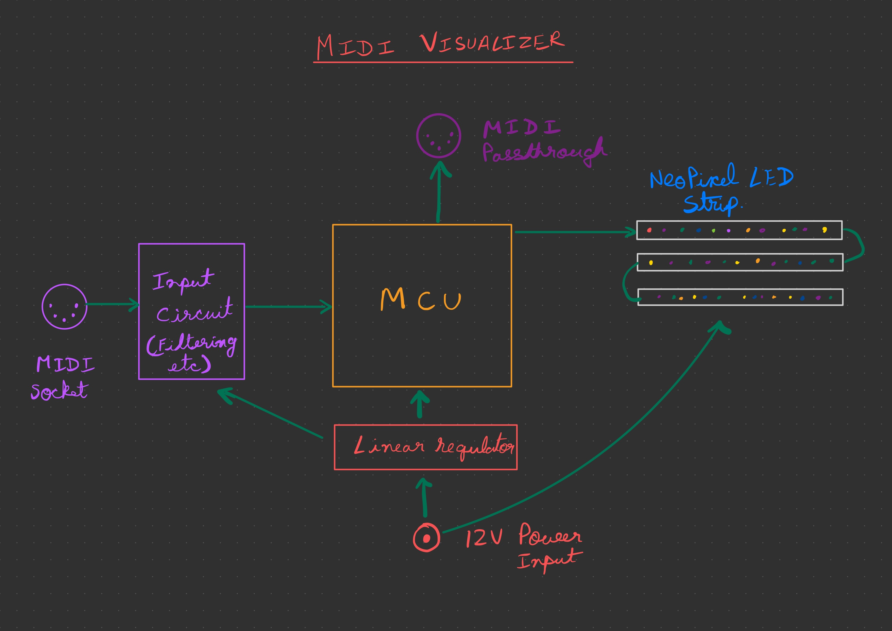

# Midi keyboard visualizer.

## Concept
A dynamic midi-driven visualizer that translates an incoming midi signal into dynamic patterns on a rudimantary LED screen made of multiple rows of a neopixel LED strip. 

## Overview of design 

The device would take in a MIDI input (coming from a MIDI-controller keyboard or any other source of MIDI signal) and activate the LEDS to show some interesting graphics when music is played. 

The brains of the PCB would be a MCU like an STM32 or ATmel chip. The input would be decoded and processed to create an animation. 

Optionally there could be a passthrough for daisy chaining other MIDI devices. 

## Components
See basic circuit reference images in "/idea" folder.

Resistors, assuming 5v in the main circuit: 
x4 220 Ohm resistor
x1 4.7k Ohm resistor

x2 Midi connectors, female
x1 1N914 Diode
x1 6N138 Optoisolator
x2 OpAmp (For the midi through)
x1 Linear regulator

x1 MCU, are there any good 5v options, or should we stick with 3.2?

1600-2400mm LED Strip - Neopixel or similar, might need to simplify or look for alternatives, those dimensions of the Neopixel strip are out of our budget

??v power-source, probably a laptop brick or similar

## Further research

Specified above are rought outlines, to narrow them down we need to decide/research the following:
- Input voltage of the LED strips available in the lab
- Operational voltage of the MCU
- Specifications of our power source

## Block diagram

