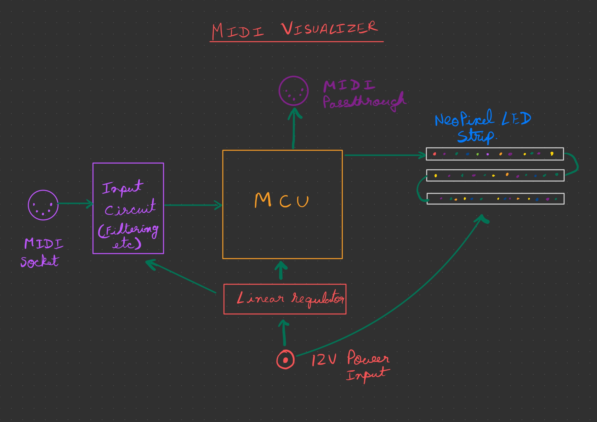

# Midi keyboard visualizer.

## Introduction
Our idea is to build a visualizer using neopixel LED strip or a dot matrix LED display for a MIDI keyboard. 

## Overview of design 

The device would take in a MIDI input (coming from the keyboard) and activate the LEDS to show some interesting graphics when music is played. 

The brains of the PCB would be a MCU like an STM32 or ATmel chip. The input would be decoded and processed to create an animation. 

Optionally there could be a passthrough for daisy chaining other MIDI devices. 

## Basic block diagram

